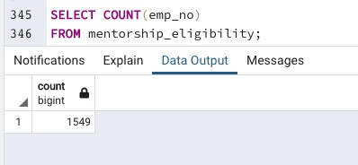

# Pewlett-Hackard-Analysis.

## **Overview of the analysis**

The purpose of this analysis is to determine the number of retiring employees per title for which we have created a number of csv files that hold all the titles of current employees who were born between January 1, 1952 and December 31, 1955. Additionally, we have created another list to identify the number of employees that were born between January 1, 1965 and December 31, 1965 and are eligible to participate in a mentorship program 

## **Results**

- After querying and retrieving the retirement titles table, we noted that there were 133,776 rows affected. However, this table contains duplicate entries because some employees have obtained promotions and switched titles over the years. 
  
 

- After applying the DISTINCT ON statement, we have filtered out those duplicate rows and obtained the most recent title for all employees. The number of rows have dropped to 90,398. which means that 43,378 duplicate rows were removed making our dataset more readable and easier to manipulate. 

- The retiring titles table encompasses seven titles with the count of retiring employees by title, respectively.

- The employees eligible to participate in the mentorship program were 1549.

## **Summary**

- The number of current employees eligible for retirement is 33,118 and the number of unique roles to be replaced (not all are current employees) is 90,398.

- According to our analysis, there are 1,549 eligible mentors. The ratio of mentors to current retiring employees is 1:21 which is a big mumber for just one mentor. 

- We reccomend that the company expands the list of eligible mentors. In this case, from November 1, 1964 to December 31, 1965. By doing this, the number of eligible mentors increases to 4645, which means that the new ratio of mentors to current retiring employees would be 1:7. 
 
 
